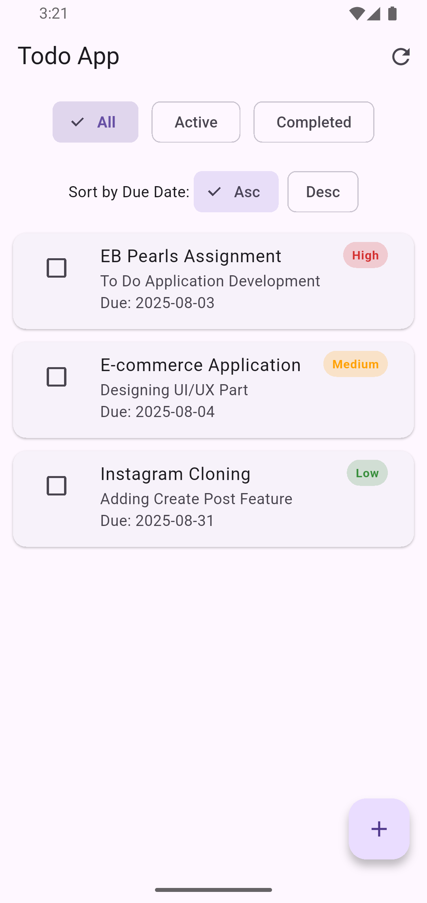
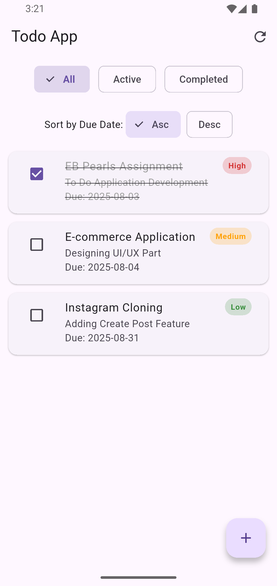
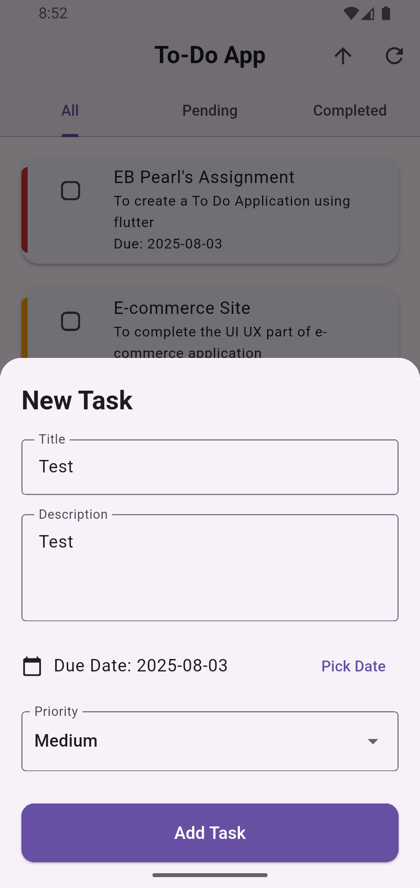
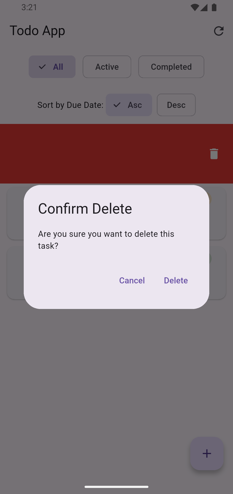
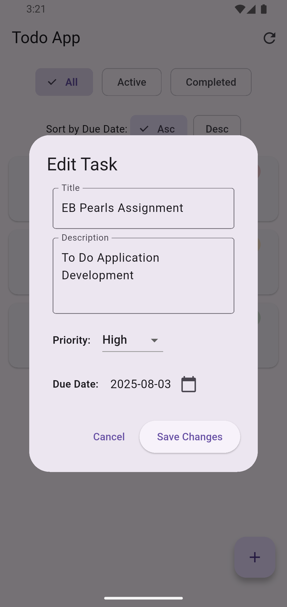
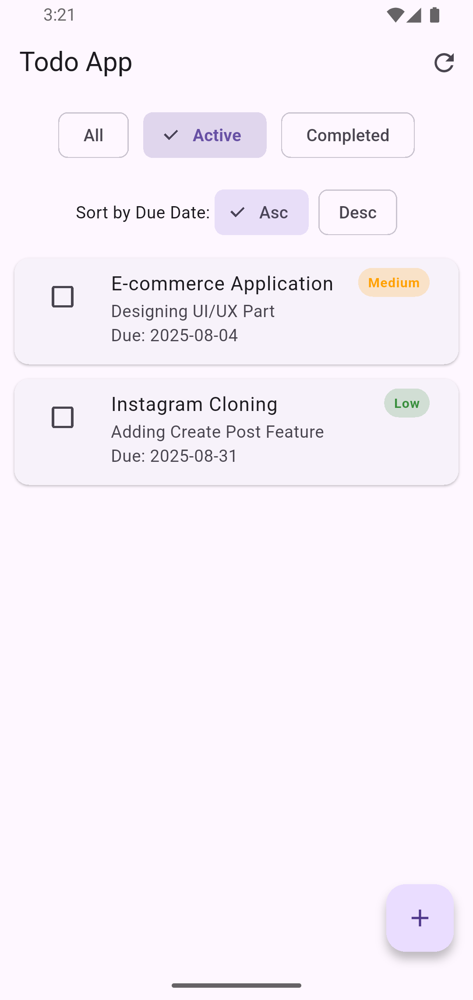
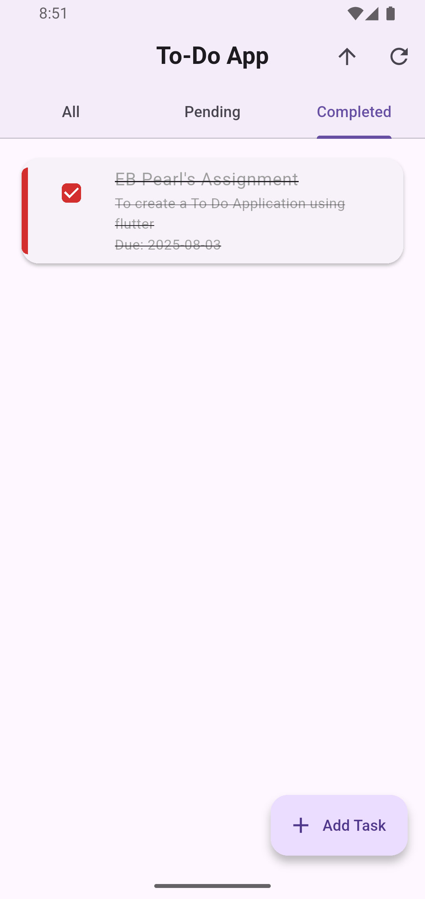

# 📝 Todo App - Flutter Clean Architecture with BLoC

A simple yet powerful Todo Application built using **Flutter**, implementing **Clean Architecture principles** and **BLoC State Management**. Users can **Add**, **Update**, **Delete**, **Filter**, and **Sort** tasks by **Due Dates** and **Priority Levels**.


<p align="center">
  
</p>

---

## ✨ Features

- 🆕 Add New Tasks with Title, Description, Due Date, and Priority.
- 📝 Edit/Update Existing Tasks.
- 🗑️ Delete Tasks.
- ✅ Mark Tasks as Completed/Pending.
- 🔍 Filter Tasks by:
  - All Tasks
  - Completed Tasks
  - Pending Tasks
- 📅 Sort Tasks by Due Date (Ascending / Descending).
- 🏗️ Clean Architecture: Layered structure (Presentation → Logic → Domain → Data).
- ⚡️ BLoC (Business Logic Component) for scalable state management.
- 🗄 Local Data Source for persistence (mock data source for demo purposes).

---

## 🧱 Project Structure

lib/

├── main.dart

├── app.dart

├── core/

│   ├── constants/

│   │   └── colors.dart

│   ├── enums/

│   │   └── priority.dart

│   └── utils/

│       └── date_formatter.dart

├── data/

│   ├── models/

│   │   └── task_model.dart

│   ├── sources/

│   │   └── local_task_data_source.dart

│   └── repositories/

│       └── task_repository_impl.dart

├── domain/

│   ├── entities/

│   │   └── task.dart

│   ├── repositories/

│   │   └── task_repository.dart

│   └── usecases/

│       ├── add_task.dart

│       ├── delete_task.dart

│       ├── get_tasks.dart

│       ├── update_task.dart

│       └── toggle_task_status.dart

├── logic/

│   └── blocs/

│       ├── task_bloc/

│       │   ├── task_bloc.dart

│       │   ├── task_event.dart

│       │   └── task_state.dart

│       └── filter_bloc/

│           ├── filter_bloc.dart

│           ├── filter_event.dart

│           └── filter_state.dart

├── presentation/

│   ├── screens/

│   │   └── home_screen.dart

│   ├── widgets/

│   │   ├── task_tile.dart

│   │   ├── task_form.dart

│   │   └── filter_buttons.dart

│   └── dialogs/

│       └── task_dialog.dart


---

## 📚 Tech Stack

- Flutter

---

## 🤝 Contributing

Pull requests are welcome!
Please open an issue first to discuss what you’d like to change.

---

## 🧑‍💻 Author

Dipesh Dhungana

---

## 📦 Download APK

> 👉 [Download Latest APK](https://github.com/iamdipesh18/to_do_application/releases/tag/v1.0.0)

Or build locally (see below).

---

## 📷 Screenshots

| Home | All Tasks |
|------|-----------|
|  |  |

| Add Task | Delete Task |
|----------|-------------|
|  |  |

| Update Task | Active Tasks |
|-------------|--------------|
|  |  |

| Completed Tasks |
|-----------------|
|  |


---
## 📺 Demo Video

> Click the image below to watch the demo video showcasing all features (Add, Update, Delete, Filter & Sort Tasks).

[](https://github.com/iamdipesh18/to_do_application/raw/main/assets/videos/Demo.mp4)

---

## 🛠️ Installation & Setup

### 🔧 Prerequisites
- Flutter SDK 
- Dart SDK
- Android Studio or VS Code

### 🧪 Run Locally

```bash
git clone https://github.com/iamdipesh18/to_do_application.git
cd to_do_application
flutter pub get
flutter run
